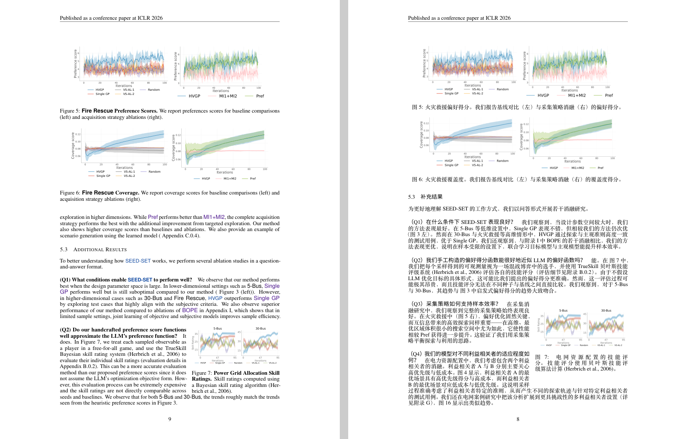

# 英文论文 PDF 翻译

这是一个面向 AI Agent 的技能（Skill）仓库。输入英文学术论文 PDF，输出地道的中文 PDF 及可复编译的 LaTeX 源码。

该技能不仅负责文本翻译，更注重**工程化的排版与校验**，确保最终交付的中文论文在视觉与结构上高度贴合原刊。

## 核心能力

* **版面与结构还原**：完整保留原论文的图表、公式、参考文献及交叉引用。双栏、跨栏、子图组合等复杂排版均与原版严格对齐。
* **自动化图件处理**：通过内置脚本自动推算图框坐标，从原 PDF 中高精度裁切矢量图与位图，避免手动截图导致的模糊或比例失调。
* **严格的质量门禁**：包含一系列 Python 校验工具。从 LaTeX 编译日志、图件有效分辨率、正文留白，到内部跳转链接与引用占位符，均由脚本执行硬性检查，拒绝“大概齐”的交付。
* **标准 A4 交付**：统一采用 A4 纸型、宋体类主字体及规范的基线间距，确保中文排版清晰、易读且适合打印。

## 效果示例

以下是英文原版与翻译排版后的版面对照。复杂的子图组合与图注均保持了原有的对应关系：

## 工作流概述

1. **解析与提取**：配合 MinerU 提取文本与排版线索，通过脚本还原双栏的自然阅读顺序。
2. **翻译与重组**：按语义单元进行中英转换，保留代码、公式与专有名词的原始形态。
3. **编译与校验**：在独立工作区生成 `main.tex` 并执行编译，通过 `scripts/` 目录下的自动化脚本完成最终的版面与逻辑核验，输出最终的同名归档目录。